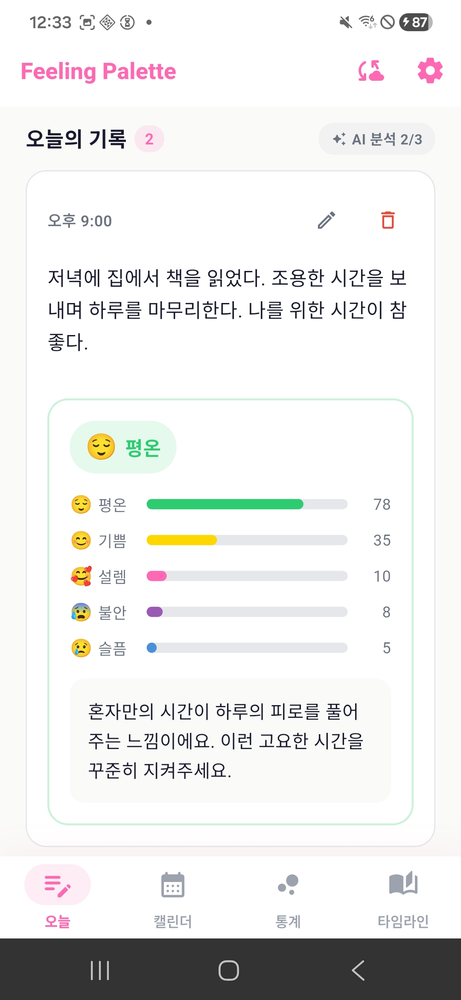
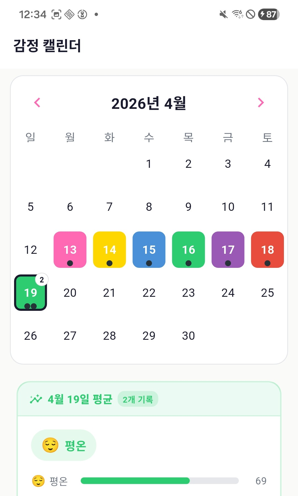
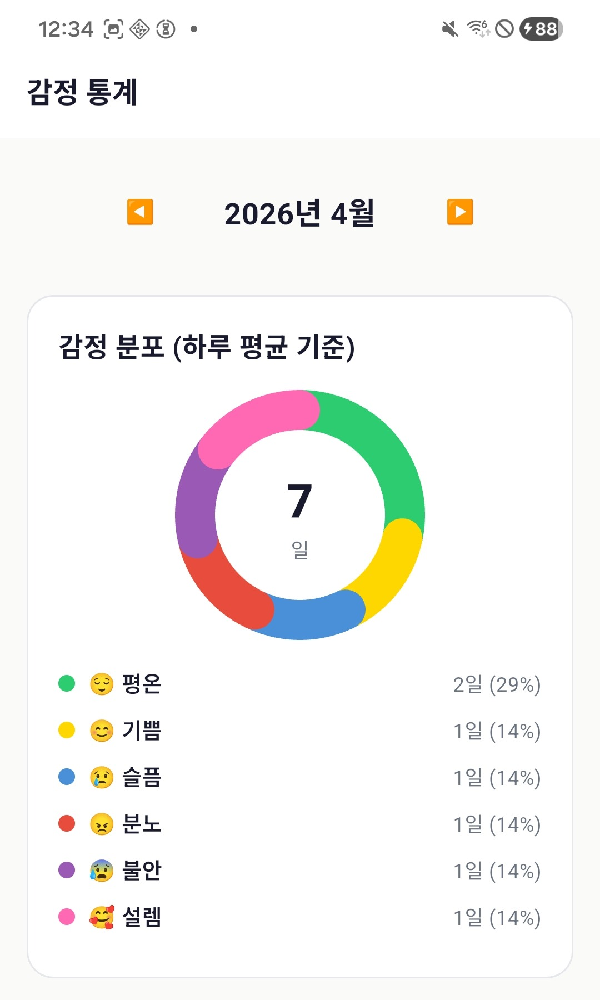
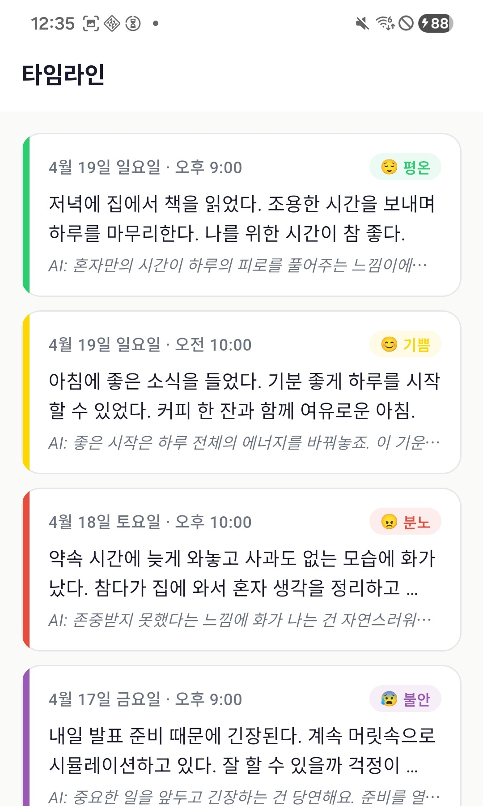
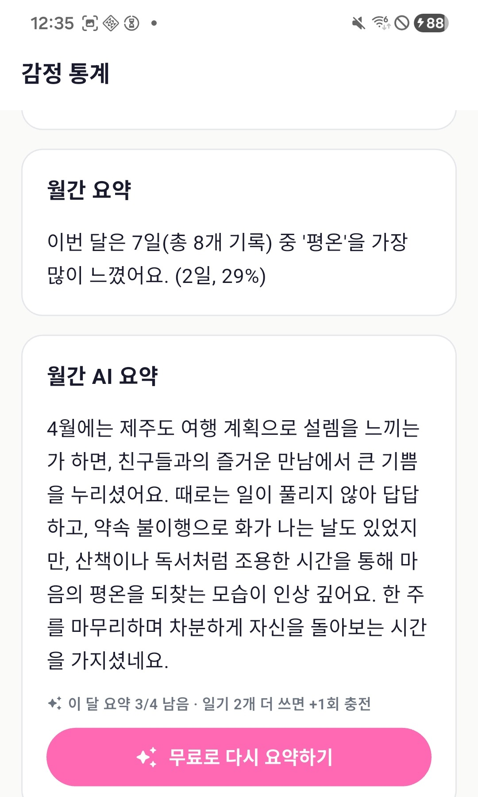

# AI 감정일기 앱을 만들어 출시까지 — Flutter 제작기

> **이 글의 대상**: 자바/스프링 백엔드 위주로 일하다가 사이드 프로젝트로 모바일 앱을 만들어보고 싶은 분
> **읽는 데 걸리는 시간**: 약 8분
> **시리즈**: 감정 팔레트 제작기 (1/4)
> **소스**: github 저장소 링크 (TODO: 발행 시 채우기)

안녕하세요. 자바 백엔드를 본업으로 하면서, 1년 정도 짬을 내어 **감정 팔레트(Feeling Palette)** 라는 AI 감정일기 앱을 만들어 출시 직전까지 끌고 왔습니다. 이 시리즈에서는 4편에 걸쳐 앱부터 백엔드, AWS 인프라, 외부 콘솔 셋업까지 한 번에 정리합니다. 첫 글은 Flutter 앱 자체 이야기입니다.


> 📷 홈 화면 — 오늘 작성한 일기 카드와 AI 분석 결과가 같이 보입니다.

---

## 1. 이 앱이 뭔가요?

한마디로 **"오늘 기분을 글로 적으면, AI가 색깔로 답해주는 일기 앱"** 입니다.

- 사용자가 일기를 쓰면 → 서버의 Gemini가 6가지 감정(기쁨/슬픔/분노/불안/평온/설렘) 점수를 매기고 한 줄 공감 메시지를 돌려줍니다.
- 결과는 감정 색상(노랑·파랑·빨강·보라·초록·핑크)으로 표시되어, 캘린더에서 한 달이 한눈에 보입니다.
- 통계 탭에서 도넛 차트와 주간 라인 그래프로 감정 흐름을 확인할 수 있습니다.
- 일기는 PIN + 생체인증으로 잠그고, Google Drive로 백업할 수 있습니다.




> 📷 같은 데이터의 세 가지 시각 — 캘린더, 통계, 타임라인.

---

## 2. 왜 Flutter였나 — 자바 개발자 시선

저는 1년 전 모바일 앱 경험이 거의 0이었습니다. 처음엔 "안드로이드는 코틀린, iOS는 스위프트 따로 하는 거 아닌가?" 부터 시작했습니다. 결론부터 말하면 Flutter를 골랐고, 이유는 단순합니다.

| 비교 항목 | 네이티브(Kotlin + Swift) | Flutter |
|---|---|---|
| 코드베이스 | 2개 (각각 작성) | 1개 (Dart) |
| 배포 빌드 | 2번 | 1번 (`build appbundle` / `build ipa`) |
| UI 코드 학습 곡선 | XML/SwiftUI 따로 | Widget 트리 하나 |
| 자바 개발자 친화도 | 코틀린은 가까움, 스위프트는 멀다 | Dart는 자바 + JS 섞은 느낌 |

자바 개발자 입장에서 Dart는 **"세미콜론 있는 자바스크립트인데 타입이 진짜 자바 같은 언어"** 라고 생각하면 잘 맞습니다. `final`, `late`, `class`, `extends`, `implements` 같은 키워드가 그대로 있고, null safety는 코틀린의 `?` / `!!` 와 거의 동일합니다.

---

## 3. 앱 구조 한눈에

`lib/` 폴더 트리만 봐도 앱이 뭘로 구성됐는지 감이 잡힙니다.

```
lib/
├── main.dart               # 앱 진입점 (Spring Boot의 Application.java)
├── constants/              # 감정·색·테마·광고 ID 상수
├── models/                 # DTO + 비즈니스 모델
├── db/                     # SQLite DAO 계층
├── providers/              # 상태 관리 (Spring 빈 + 옵저버)
├── services/               # 외부 연동 (HTTP, 인증, 광고, IAP, Drive)
├── screens/                # 화면 위젯 (5개 탭)
└── widgets/                # 재사용 컴포넌트 (카드, 차트, 광고 슬롯)
```

**상태 관리는 `Provider` 패키지** 를 씁니다. Provider는 자바 개발자에게 익숙한 말로 옮기면 **"Spring 빈으로 등록된 옵저버블 객체"** 입니다. 화면이 `ChangeNotifier` 를 구독하다가, 비즈니스 로직에서 `notifyListeners()` 를 호출하면 화면이 다시 그려집니다. Spring 이벤트 리스너와 매우 비슷합니다.

핵심 Provider는 두 개입니다.

- **`DiaryProvider`** : 일기 CRUD, 일일 분석 한도, 월간 요약 쿼터, 광고 보너스
- **`AuthProvider`** : 잠금 상태(`loading / needsSetup / locked / unlocked`) + 앱 라이프사이클 관찰

---

## 4. 데이터 모델 & SQLite

데이터는 전부 로컬에 둡니다 (개인 일기를 클라우드에 보관하면 사용자 입장에서 부담스럽기 때문). DB는 **SQLite (`sqflite` 패키지)** 를 사용했고, 스키마는 단순합니다.

```sql
CREATE TABLE diary_entries (
  id TEXT PRIMARY KEY NOT NULL,
  date TEXT NOT NULL,                  -- 'YYYY-MM-DD'
  content TEXT NOT NULL,
  primary_emotion TEXT NOT NULL,       -- 'joy' | 'sadness' | ...
  emotions_json TEXT NOT NULL,         -- 6감정 점수 JSON
  ai_comment TEXT NOT NULL DEFAULT '',
  color TEXT NOT NULL DEFAULT '#9CA3AF',
  created_at INTEGER NOT NULL,
  updated_at INTEGER NOT NULL,
  analysis_count INTEGER NOT NULL DEFAULT 0
);
CREATE INDEX idx_diary_date ON diary_entries(date);
```

마이그레이션은 `onUpgrade` 콜백에서 버전별 `ALTER TABLE` 로 처리합니다. 자바라면 Flyway / Liquibase 쓰는 그 자리에 들어가는 코드입니다. 현재 DB 버전은 4까지 와 있고, 매번 컬럼 추가 + 백필 SQL을 같이 적어 두었습니다.

감정 enum과 점수 모델은 이렇게 생겼습니다.

```dart
enum EmotionType { joy, sadness, anger, anxiety, calm, excitement }

class EmotionScores {
  final int joy, sadness, anger, anxiety, calm, excitement;

  factory EmotionScores.fromJson(Map<String, dynamic> json) {
    int parse(dynamic v) =>
        v is num ? v.round().clamp(0, 100) : 0;
    return EmotionScores(
      joy: parse(json['joy']),
      sadness: parse(json['sadness']),
      // ... 생략
    );
  }
}
```

각 감정에는 색상 HEX가 매핑되어 있습니다 (`constants/emotions.dart`). 이 색상은 그대로 캘린더 셀, 카드 배경, 도넛 차트에 재사용되어서 **앱 전반의 일관된 "감정 팔레트"** 를 만듭니다.

---

## 5. AI 분석은 어떻게 호출하나

서버 호출은 평범한 HTTP POST입니다. 자바 개발자라면 RestTemplate / WebClient 쓰는 자리라고 보면 됩니다.

```dart
const String _apiBaseUrl = 'https://feeling-api-aws.sedoli.co.kr';

class EmotionAnalyzer {
  Future<AnalysisResult> analyze(String content) async {
    final uri = Uri.parse('$_apiBaseUrl/api/diary/analyze');
    final response = await http.post(
      uri,
      headers: {'Content-Type': 'application/json'},
      body: jsonEncode({'content': content}),
    );

    if (response.statusCode < 200 || response.statusCode >= 300) {
      throw Exception('서버 오류 ${response.statusCode}: ${response.body}');
    }

    final parsed = jsonDecode(utf8.decode(response.bodyBytes))
        as Map<String, dynamic>;
    // primary_emotion, emotions, comment 파싱 ...
    return AnalysisResult(/* ... */);
  }
}
```

- 백엔드는 AWS Lambda 위에 올라간 FastAPI입니다 (자세한 건 2·3편).
- 사용자 텍스트는 서버에 **저장되지 않습니다.** 분석 끝나면 즉시 폐기되고, 응답만 앱이 받아 SQLite에 저장합니다.
- 분석 한도는 일기 1개당 최대 3회, 하루 최대 3개 일기 분석. 더 쓰고 싶으면 리워드 광고로 +5개까지 풀 수 있습니다.


> 📷 한 달치 일기를 모아 만든 월간 AI 요약 카드 — 분석 결과는 이런 식으로 누적됩니다.

---

## 6. 앱 잠금: PIN + 생체인증

개인 일기라서 잠금 기능은 사실상 필수였습니다. 자바에서 비밀번호 저장하면 `BCryptPasswordEncoder` 쓰죠. Flutter에선 직접 짜야 했는데, 결국 비슷한 패턴이 됩니다.

```dart
String _hashPin(String pin, String salt) {
  final saltBytes = utf8.encode(salt);
  final pinBytes = utf8.encode(pin);
  var digest = sha256.convert([...saltBytes, ...pinBytes]).bytes;
  for (var i = 0; i < 5000; i++) {
    digest = sha256.convert([...digest, ...saltBytes]).bytes;
  }
  return base64Encode(digest);
}
```

- **salt 16바이트 랜덤 생성** + **SHA-256 5000회 stretching**
- 해시와 salt 모두 `flutter_secure_storage` 에 저장 → 안드로이드는 `EncryptedSharedPreferences`, iOS는 Keychain
- 생체인증은 `local_auth` 패키지 (Face ID / 지문)
- 앱이 백그라운드 → 포그라운드로 돌아올 때 라이프사이클 관찰자가 경과 시간을 재서 자동 잠금

PIN을 잊어버리면 복구 불가능합니다. 대신 "비밀번호 잊으셨나요?" 버튼으로 **앱 데이터 전체 초기화 후 PIN 재설정** 흐름을 제공합니다. 이건 보안상 의도된 트레이드오프입니다.

---

## 7. 광고 / IAP / 백업 — 한 단락씩

- **광고**: AdMob 배너(캘린더·통계·타임라인 탭만), 전면(분석 2회마다 + 세션당 1회 + 3분 쿨다운), 리워드(분석 한도 추가 언락). 모두 `AdsService` 한 곳에서 throttling 합니다.
- **IAP**: `remove_ads` 라는 비소모성 상품 1개, ₩2,500. 결제하면 배너·전면이 사라지고 리워드는 유지됩니다 (`PremiumService` 가 상태 관리).
- **백업**: Google Sign-In + Google Drive `appdata` 스코프(앱 전용 숨김 폴더)로 일기 JSON을 업로드/복원합니다. 사용자의 Drive 안에 들어가므로 별도 서버가 필요 없습니다.

이 셋의 **콘솔 셋업** 은 4편에서 한꺼번에 다룹니다.

---

## 8. 회고 — 가장 헤맸던 두 가지

**(1) 라이프사이클이 생각보다 까다롭다.**
앱이 잠금된 상태에서 화면 캡처가 보이면 안 되고, 라이프사이클 이벤트(`paused / hidden / resumed`)가 OS마다 다르게 발생합니다. iOS는 알림센터를 내리는 순간 `inactive` 가, 안드로이드는 그냥 `paused` 만 옵니다. 결국 `paused` 와 `hidden` 둘 다 잡고, 경과 시간은 별도 타이머로 재는 식으로 안정화했습니다.

**(2) Provider의 의존성 그래프 폭발.**
`DiaryProvider` 가 `AdsService` 를 알아야 하고, `AdsService` 는 `PremiumService` 의 ad-free 플래그를 봐야 하고… 자바라면 그냥 `@Autowired` 로 끝낼 일이 Dart에선 `MultiProvider` + `ProxyProvider` 로 손수 엮어야 합니다. **"의존성 주입은 결국 어디든 똑같이 어렵다"** 는 걸 다시 배웠습니다.

---

## 마치며

다음 편에서는 이 앱이 호출하는 백엔드 — **FastAPI + LangChain + Gemini** 로 짠 감정 분석 API 이야기를 합니다. 스프링 부트만 쓰던 자바 개발자에게 FastAPI가 얼마나 가벼운 충격인지, 그리고 LLM 호출을 어떻게 안전하게 감싸는지 보여드릴게요.

---

### 🎨 감정 팔레트 제작기 시리즈

- **1편: AI 감정일기 앱 제작기 (Flutter)** ← 현재 글
- 2편: 감정 분석 API (FastAPI + Gemini)
- 3편: AWS Lambda 인프라 (NAS → Serverless 마이그레이션)
- 4편: 앱 등록 & 외부 콘솔 셋업 총정리
