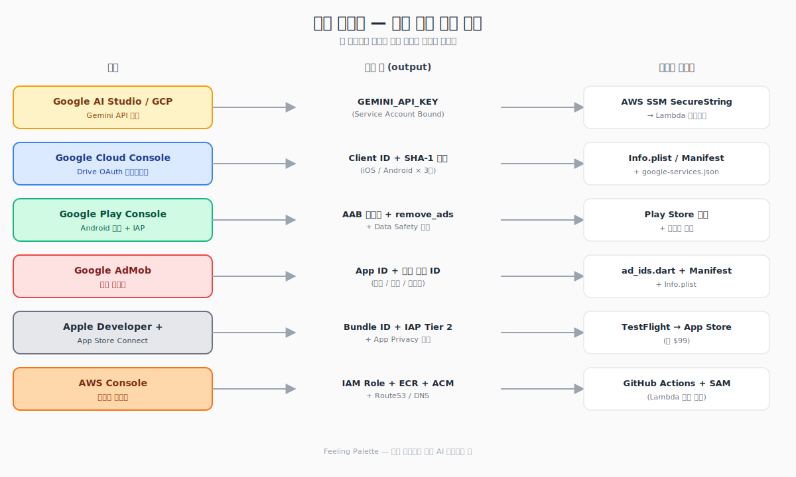

# 처음 앱 출시하기 — Gemini, Play Console, GCP, AdMob, Apple Developer 한 번에 정리

> **이 글의 대상**: 코드는 다 됐는데 "어디에 뭘 등록해야 출시가 되는지" 길을 잃은 분
> **읽는 데 걸리는 시간**: 약 10분
> **시리즈**: 감정 팔레트 제작기 (4/4)
> **소스**: github 저장소 링크 (TODO: 발행 시 채우기)

[1편](./01-app-making-story.md)에서 [3편](./03-aws-lambda-infra.md)까지 코드와 인프라 이야기를 했습니다. 마지막은 한 발짝 떨어져서 보는 시야 — **"이 앱을 실제로 출시하려면 외부 콘솔 6개를 어떻게 셋업해야 하는가"** 입니다. 처음 출시하면 이 콘솔들을 들락날락하다가 자기가 어디에서 뭘 했는지 잊어버리기 십상이라, 한 장의 지도가 필요합니다.

---

## 0. 전체 지도 — 어떤 콘솔에서 무엇을 받아 어디에 넣는가

```
┌─────────────────────────────────┐    받는 것              어디에 넣는지
│ Google AI Studio / GCP          │ →  GEMINI_API_KEY    →  AWS SSM SecureString → Lambda env
│ Google Cloud Console (OAuth)    │ →  Drive Client ID   →  Info.plist / google-services.json
│ Google Play Console             │ →  AAB 업로드 + IAP  →  스토어 노출
│ Google AdMob                    │ →  App ID + Unit ID  →  AndroidManifest / Info.plist / ad_ids.dart
│ Apple Developer + App Store Connect │ → Bundle ID, IAP, App Privacy → 스토어 노출
│ AWS Console                     │ →  IAM/OIDC, ECR, ACM →  GitHub Actions + SAM
└─────────────────────────────────┘
```

이 표를 머릿속에 넣고 시작하면, 어느 화면에 들어왔을 때 길을 잃지 않습니다.


> 📷 위 ASCII 표를 보기 좋게 정리한 6개 콘솔의 입출력 지도.

---

## 1. Google AI Studio / GCP — Gemini API 키

처음에는 `aistudio.google.com` 에서 키를 발급하는 게 가장 빠릅니다. 단, **두 종류의 키가 있고 차이를 반드시 알아야** 합니다.

| 키 종류 | 형식 | 용도 | 학습 사용 |
|---|---|---|---|
| AI Studio 키 | `AIzaSy...` | 개발/테스트 | Free 티어는 ✅ (Google이 학습에 사용 가능) |
| **Service Account Bound 키** | `AQ.Ab8...` | **프로덕션 권장** | Paid 티어 ❌ (학습 사용 안 함) |

사용자 일기를 다루는 서비스라면 **Paid 티어 + Service Account Bound 키** 가 사실상 필수입니다. Google 정책상 Paid 호출은 학습에 쓰이지 않기 때문입니다.

### Paid Tier 전환 절차

1. **Google Cloud Console** 에서 결제 계정 생성 (신용카드 등록)
2. 프로젝트에 결제 계정 연결
3. **Vertex AI / Generative Language API** 활성화
4. 서비스 계정에 키 발급 → 출력값이 `AQ.Ab8...` 로 시작하면 성공
5. **Budget 알람** 필수 설정 — 월 $5 정도로 잡아두면 폭주해도 안전

발급한 키는 코드에 박지 말고 **AWS SSM SecureString** 에 넣어두면, [3편](./03-aws-lambda-infra.md)에서 다룬 GitHub Actions 워크플로가 자동으로 가져갑니다.

---

## 2. Google Cloud Console — Drive OAuth

앱의 Google Drive 백업 기능 때문에 OAuth 클라이언트도 따로 만들어야 합니다. 가장 흔한 시행착오는 **SHA-1 지문을 빠뜨려서 로그인 창이 열렸다가 즉시 닫히는** 현상입니다.

### 절차

1. **APIs & Services → Library** → "Google Drive API" 활성화
2. **OAuth consent screen** → External, Testing 모드, scope에 `drive.appdata` 추가 (별도 검증 불필요)
3. **Credentials → Create Credentials → OAuth client ID**
   - **Android** 클라이언트:
     - Package name: `com.feelingpalette.feeling_palette`
     - SHA-1 지문: 아래 §"등록할 SHA-1 3종" 참조
   - **iOS** 클라이언트:
     - Bundle ID: `com.feelingpalette.feelingPalette` (iOS는 camelCase, Android와 다름에 주의)
     - 발급된 iOS Client ID는 `Info.plist` 의 `GIDClientID` 와 `CFBundleURLSchemes` 에 등록

### 등록할 SHA-1 3종 (Android)

같은 앱이라도 **빌드 종류별로 SHA-1이 전부 다릅니다.** 빠뜨리면 그 환경에서 로그인이 막힙니다.

| 빌드 | 키스토어 | 어디서 확인 |
|---|---|---|
| 로컬 개발 (`flutter run`) | `~/.android/debug.keystore` | `keytool -list -v -keystore ...` |
| 사이드로드/내부배포 | `~/upload-keystore.jks` | `keytool` 또는 `apksigner verify --print-certs` |
| **Play Store 배포** | **Play 재서명 키** | Play Console → 앱 무결성 → 앱 서명 |

특히 마지막 **Play 재서명 키 SHA-1** 을 누락하면, 개발 빌드에선 잘 되던 로그인이 **스토어에서 받은 앱에서만 안 됨** 이라는 가장 짜증나는 버그가 생깁니다.

---

## 3. Google Play Console — Android 출시

순서대로 진행:

1. **새 앱 만들기** — 이름(`감정 팔레트`), 언어(한국어), 무료/유료
2. **앱 콘텐츠** 섹션 모두 채우기:
   - 개인정보처리방침 URL (GitHub Pages 무료 호스팅 가능)
   - 광고 포함: **예 (AdMob)**
   - 앱 액세스: 잠금 → 테스트 계정 정보 제공 (PIN 1234)
   - 콘텐츠 등급 설문
   - **Data Safety** — 아래 표 참조
3. **스토어 등록정보** — 스크린샷, 설명, 아이콘
4. **앱 번들 업로드** — `flutter build appbundle --release --dart-define-from-file=.env.json` → `build/app/outputs/bundle/release/app-release.aab`
5. **내부 테스트 → 비공개 → 공개 프로덕션** 순서로 점진 출시

### Data Safety 선언 (필수)

| 카테고리 | 항목 |
|---|---|
| 개인정보 | 이메일 주소 (Drive 백업 선택 시) |
| 기기 식별자 | 광고 식별자 (AdMob) |
| 앱 활동 | 검색/기록 (로컬만) |
| 사용자 콘텐츠 | 텍스트(일기 — 로컬 저장, AI 분석 위해 임시 전송) |
| 제3자 공유 | Google AdMob |
| 전송 시 암호화 | 예 (HTTPS) |
| 사용자 삭제 요청 | 예 (앱 내 데이터 초기화) |

### IAP `remove_ads` 등록

- Play Console → **수익 창출 → 인앱 제품**
- 상품 ID: `remove_ads`, 종류: 비소모성, 가격: ₩2,500
- 활성화 후 **라이선스 테스트 계정** 추가 → 실결제 없이 검증

---

## 4. Google AdMob — 광고

AdMob 콘솔에서 먼저 **앱 등록** → **광고 단위 생성** 순으로 합니다.

```
앱 1개당:
├── App ID            (예: ca-app-pub-XXXXXXXXXXXXXXXX~XXXXXXXXXX)
└── 광고 단위 ID들
    ├── Banner        (ca-app-pub-XXXXXXXXXXXXXXXX/XXXXXXXXXX)
    ├── Interstitial
    └── Rewarded
```

이 ID들은 코드에 그대로 박혀도 됩니다 (AdMob ID는 시크릿이 아닙니다). 다만 **개발 중 실 ID로 광고를 띄우면 자기 노출이라 정책 위반** 이라, 디버그/릴리스 분기를 둡니다.

```dart
// lib/constants/ad_ids.dart 의 패턴
class AdIds {
  static String get banner {
    if (Platform.isAndroid) {
      return kReleaseMode
          ? 'ca-app-pub-XXXXXXXXXXXXXXXX/XXXXXXXXXX'      // 실제 ID
          : 'ca-app-pub-3940256099942544/6300978111';     // Google 테스트 ID
    }
    return kReleaseMode
        ? 'ca-app-pub-XXXXXXXXXXXXXXXX/XXXXXXXXXX'
        : 'ca-app-pub-3940256099942544/2934735716';
  }
  // interstitial / rewarded 도 같은 구조
}
```

`ca-app-pub-3940256099942544` 로 시작하는 건 **Google이 공식 제공하는 테스트 ID** 입니다. 디버그 빌드에서는 무조건 이걸 쓰면 안전합니다.

### Mediation 로드맵

처음에는 AdMob 단독으로 출시하고, 안정화되면 광고 매개(mediation)를 단계적으로 추가하는 게 좋습니다.

- **Phase 1**: AdMob 단독 (현재)
- **Phase 2**: Pangle 추가 — 사업자 등록 후
- **Phase 3**: AppLovin MAX, Meta, Unity Ads

---

## 5. Apple Developer + App Store Connect — iOS 출시

Apple은 **연 $99 (약 ₩130,000)** 결제가 시작점입니다.

1. **Apple Developer 등록** — `developer.apple.com/programs/`
2. **Bundle ID 등록** — `com.feelingpalette.feelingPalette` (iOS는 camelCase. Android의 `com.feelingpalette.feeling_palette` 와 표기 규칙이 달라서 둘 다 정확히 맞춰야 함)
3. **App Store Connect → 새 앱**
   - 플랫폼: iOS
   - 기본 언어: 한국어
   - SKU: 고유 식별자 (예: `feeling-palette-ios`)
4. **앱 정보 입력** — 카테고리(라이프스타일/건강), 개인정보처리방침 URL, 가격
5. **App Privacy 선언** — Play의 Data Safety와 거의 동일
   - Contact Info → Email
   - Identifiers → Device ID, IDFA
   - User Content → Diary entries
6. **IAP 등록** — `remove_ads`, 비소모성, **Tier 2 (₩2,500)**
7. **샌드박스 테스터 추가** — 평소 사용하지 않는 별도 Apple ID
8. **빌드 업로드**:
   ```bash
   flutter build ipa --release --dart-define-from-file=.env.json
   ```
   → Xcode → Product → Archive → Distribute → App Store Connect
9. **TestFlight 내부 테스트** — 광고/IAP/Drive/잠금 플로우 전부 한 번씩
10. **심사 제출** — 보통 24~48시간, 길면 1주

### App Privacy 항목 매핑

| App Store Connect 항목 | 우리 앱의 무엇 |
|---|---|
| Contact Info → Email | Google Sign-In |
| Identifiers → Device ID | AdMob 광고 식별자 |
| Identifiers → IDFA | 광고 추적 권한(ATT) 동의 시 |
| User Content → Other User Content | 일기 본문 (로컬 + AI 분석용 임시 전송) |

---

## 6. AWS Console — 인프라 사전준비

[3편](./03-aws-lambda-infra.md)에서 다룬 인프라를 굴리려면 AWS 콘솔에서 미리 해둘 것이 있습니다.

### 한 번만 하면 되는 것

1. **IAM 사용자 + MFA** — 루트 계정은 봉인하고 IAM 사용자로만 작업
2. **Budget 알람** — 월 $5 임계치로 이메일 발송
3. **OIDC Provider 등록** — `https://token.actions.githubusercontent.com`
4. **IAM Role `github-actions-feeling-palette` 생성**
   - Trust policy: GitHub repo 한정 (`repo:사용자명/저장소명:ref:refs/heads/main`)
   - 권한: ECR push/pull, Lambda 업데이트, CloudFormation, SSM Decrypt, CloudWatch Logs
5. **ECR 저장소** `feeling-palette` 생성 (이미지 보관 정책: 최신 10개만)
6. **ACM 인증서** — `feeling-api-aws.sedoli.co.kr` 같은 커스텀 도메인용 (DNS 검증)
7. **Route53 또는 가비아 DNS** — API Gateway 커스텀 도메인을 가리키는 CNAME

### 도메인이 가비아인 경우 (Route53 안 쓰는 경우)

```
가비아 DNS 레코드:
  feeling-api-aws.sedoli.co.kr  CNAME  d-xxxxxxxxxx.execute-api.ap-northeast-2.amazonaws.com
```

ACM은 us-east-1이 아니라 **API Gateway가 있는 리전(`ap-northeast-2`)** 에서 발급해야 매핑됩니다. 첫 출시 때 이걸로도 시간 좀 썼습니다.

---

## 7. 종합 체크리스트 (출시 직전 30개)

코드 외 모든 외부 셋업이 끝났는지 한 번에 점검:

### 공통
- [ ] 개인정보처리방침 URL 호스팅 완료
- [ ] 앱 아이콘 1024×1024 준비
- [ ] 스크린샷 6.7" / 5.5" 각 5장 이상
- [ ] 연락처 이메일 운영 가능한 것으로 준비

### Gemini / GCP
- [ ] Gemini API 키 발급 (Service Account Bound 권장)
- [ ] Paid Tier 전환 + 결제 계정 연결
- [ ] Budget 알람 $5 설정
- [ ] AWS SSM SecureString에 키 저장 (`/feeling-palette/gemini-api-key`)
- [ ] Drive API 활성화 + OAuth consent screen 등록
- [ ] Android OAuth Client (debug / upload / Play 재서명 키 SHA-1 3종)
- [ ] iOS OAuth Client + `Info.plist` 매핑

### AdMob
- [ ] 앱 등록 → App ID 발급
- [ ] 배너/전면/리워드 광고 단위 ID 발급
- [ ] `ad_ids.dart` 디버그/릴리스 분기 코드 확인
- [ ] AndroidManifest + Info.plist에 App ID 입력
- [ ] (출시 후) AdMob 콘솔 → 앱 설정에 스토어 URL 연결

### Google Play Console
- [ ] 앱 만들기 + 메타데이터
- [ ] Data Safety 선언 6항목
- [ ] IAP `remove_ads` 비소모성 ₩2,500 등록
- [ ] 라이선스 테스트 계정 추가
- [ ] AAB 업로드 → 내부 테스트 트랙

### Apple Developer / App Store Connect
- [ ] Apple Developer Program 결제 (연 $99)
- [ ] Bundle ID 등록
- [ ] App Store Connect 앱 생성 + 메타데이터
- [ ] App Privacy 선언
- [ ] IAP `remove_ads` Tier 2 등록
- [ ] 샌드박스 테스터 추가
- [ ] TestFlight 빌드 업로드 + 내부 테스트

### AWS
- [ ] IAM 사용자 + MFA + Budget
- [ ] OIDC Provider + GitHub Actions Role
- [ ] ECR 저장소 + 보관 정책
- [ ] ACM 인증서 (`ap-northeast-2`)
- [ ] DNS CNAME 매핑

### 출시 전 마지막 보안 점검
- [ ] `.env.json` 커밋 안 됨
- [ ] `android/key.properties`, `*.jks` 커밋 안 됨
- [ ] Gemini 키, 광고 ID 등 시크릿이 git log에 안 보임
- [ ] 실기기에서 릴리스 빌드 — 광고/IAP/Drive/잠금 모두 동작

---

## 마치며

이걸로 4편 시리즈가 끝납니다. **"감정 팔레트"** 라는 작은 사이드 프로젝트 하나를 굴리는 데도 콘솔 6개, 외부 서비스 10개 가까이가 얽혀 있었습니다. 처음에는 정신없지만, 한 번 셋업해두면 두 번째 앱부터는 같은 패턴이 거의 그대로 재사용됩니다.

자바 백엔드 개발자에게도 모바일 + AI + 클라우드 조합은 충분히 도전해볼 만한 영역이라는 게, 이번 프로젝트에서 얻은 가장 큰 결론이었습니다. 자세한 코드와 인프라 설정은 시리즈 1~3편을 참고해주세요. 질문은 댓글로 환영합니다.

---

### 🎨 감정 팔레트 제작기 시리즈

- [1편: AI 감정일기 앱 제작기 (Flutter)](./01-app-making-story.md)
- [2편: 감정 분석 API (FastAPI + Gemini)](./02-api-fastapi-gemini.md)
- [3편: AWS Lambda 인프라 (NAS → Serverless 마이그레이션)](./03-aws-lambda-infra.md)
- **4편: 앱 등록 & 외부 콘솔 셋업 총정리** ← 현재 글
